# Aulas01-Node-React
Aulas01 - Node/React

Data Integra - Projeto Api
Projeto criado durante a aula na Data Integra

### Tecnologias
- Node.js
- Express
- Prisma
- PostgreSQL
- TypeScript
  
### Como rodar o projeto
Clone o repositório

Instale as dependências com `npm install`.

Crie um arquivo `.env` com base no arquivo `.env.example`.

Rode as migrations com `npm run migrate`.

Rode o projeto com `npm run dev`.

link:
```
https://regular-mink-7ec.notion.site/Aulas-Node-React-506c81e7473a498a9c890a97265860fe
```

### Instalação do JEST
`npm install --save-dev jest @types/jest ts-jest`.

Após isso executar o comando para iniciar o jest na nossa aplicação, com o seguinte:
`npx jest --init`

<h1 align="center">
    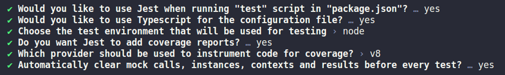
</h1>

Sera criado um arquivo `jest.config.ts`.

Dentro do arquivo `jest.config.ts` procure por preset;
<h1 align="center">
    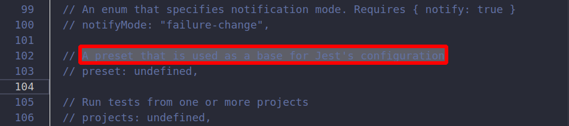
</h1>
e altere a linha de código para que fique da seguinte forma:
<h1 align="center">
    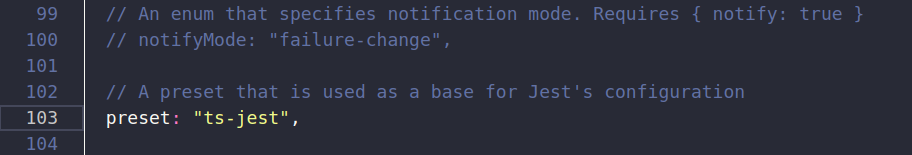
</h1>

### Instalando os ESLint
Caso esteja usando o NPM como gerenciador de pacotes, basta, na pasta raiz do seu projeto Node, executar o seguinte comando no terminal:
`npm install eslint -D`.

`yarn add eslint -D`.

### Configurando ESLint
`npm init @eslint/config`.

`yarn eslint --init`.

A primeira configuração que precisamos definir é com qual propósito iremos usar o ESLint. O nosso propósito será checar sintaxe, encontrar problemas e garantir a aplicação de um estilo de código. Ficará assim:
<h1 align="center">
    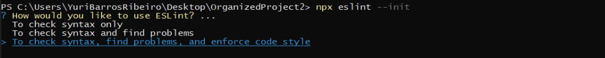
</h1>

O próximo passo é definir que tipo de módulos usamos no nosso projeto. O Node.js ainda não aceita a sintaxe de import/export do ES6, mas como eu estou usando o pacote Sucrase (fica a dica) para contornar isso, irei escolhê-lo:
<h1 align="center">
    
</h1>

Se você estiver usando o Sucrase ou Babel para ativar a sintaxe import/export, então faça como eu. Mas se não, escolha o padrão do Node.js, que é o CommonJS.

O próximo passo é definir se você está utilizando algum Framework. Como estamos num projeto Node.js, iremos escolher None of these:
<h1 align="center">
    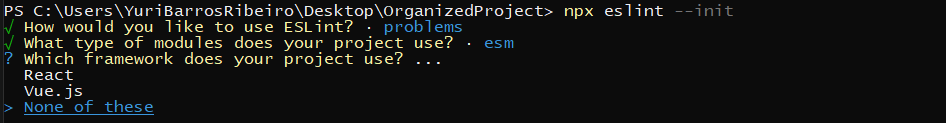
</h1>

É importante também para o ESLint saber se estamos usando Typescript. Como eu não estou utilizando no meu projeto, então respondi que não:
<h1 align="center">
    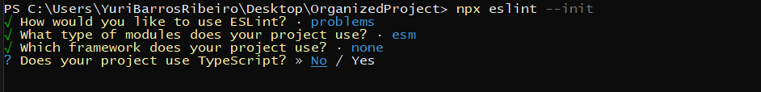
</h1>

Agora, você precisa informar qual o destino do seu código. Se irá rodar no browser ou no Node. Já que o contexto aqui é usarmos ESLint com Node, então vamos selecionar Node mesmo. Para isso, com a tecla espaço, desselecione Browser e selecione Node e, depois, confirme com a tecla enter:
<h1 align="center">
    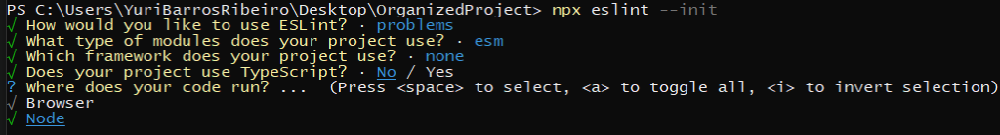
</h1>

Nessa etapa, deveremos definir o estilo que seguiremos no nosso código. Iremos escolher um estilo popular:
<h1 align="center">
    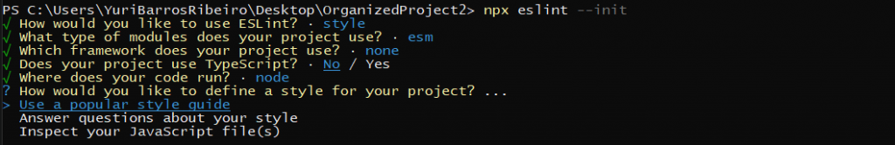
</h1>

Na próxima etapa, irei escolher o style guide que mencionei anteriormente, o da Airbnb:
<h1 align="center">
    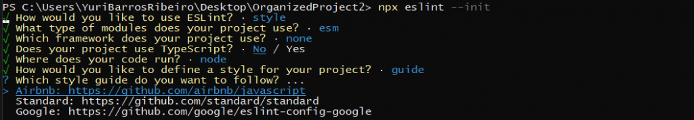
</h1>

O estilo da Airbnb segue alguns padrões que já falamos, como pôr ponto e vírgula ao fim de cada setença de código, vírgula após último elemento de um array ou depois do último atributo de um objeto, strings são delimitadas por aspas simples… Para ver a lista de regras presentes no style guide da Airbnb, basta dar uma olhada nesse link.

Continuando, agora definiremos o formato do arquivo no qual você poderá realizar algumas configurações adicionais do ESLint. Nesse arquivo, também poderemos definir ou sobrescrever regras que ele irá analisar no nosso projeto. Particularmente, gosto desse arquivo no formato JavaScript:
<h1 align="center">
    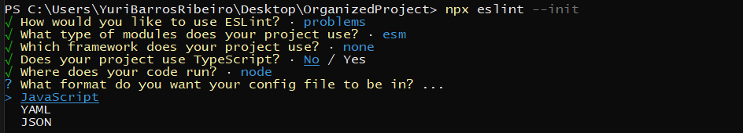
</h1>

Após a etapa anterior, será perguntando a você se deseja instalar as dependências relacionadas ao style guide escolhido. Confirme:
<h1 align="center">
    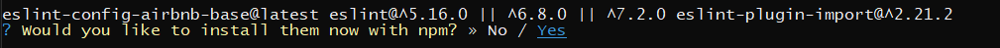
</h1>


### No PostgreSQL
